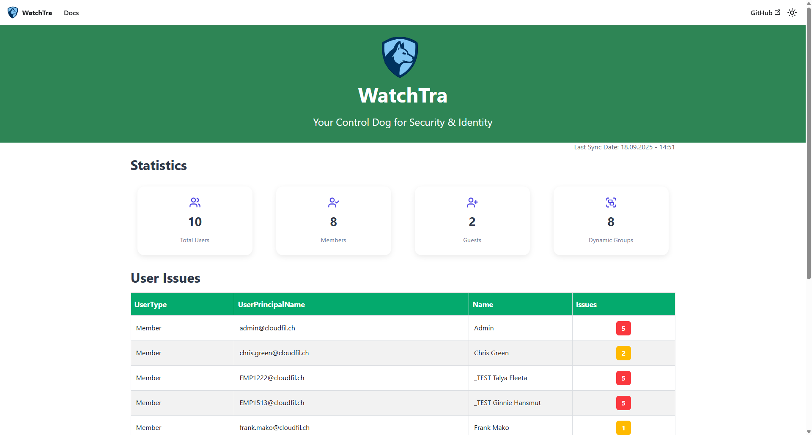
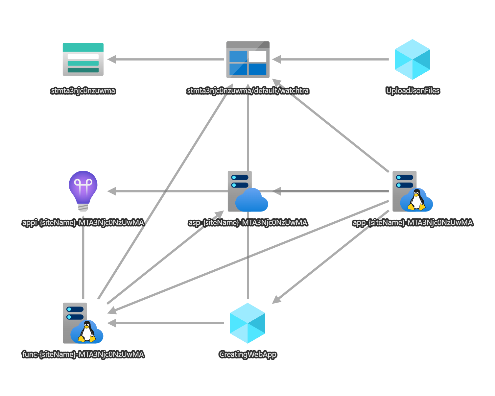

# WatchTra

**WatchTra** is a web application for **Microsoft Entra ID** that helps organizations enforce compliance in user attributes. It compares values stored in Entra ID user properties against a predefined compliance dictionary and highlights non-compliant entries.

## Features

- 🔍 **Compliance Monitoring** – Detects inconsistent or invalid user attributes.  
- 📊 **Dashboard** – Visualizes only non-compliant users.  
- ⚡ **Automation** – Hourly data fetch from Entra ID and automatic webapp updates.  
- 🛠 **Configurable Rules** – Define your organization’s compliance standards in JSON.  



## Architecture Overview

WatchTra is built entirely on **Azure**:

- **Azure Function App** – Backend logic, API endpoints, scheduled data fetch, and webapp rebuild.  
- **Azure Web App** – Hosts the Docusaurus-based frontend dashboard.  
- **Azure Storage Account** – Stores compliance dictionaries, processed data, and static assets.  
- **GitHub Repository** – Source of truth for frontend code.  



# Installation

To install **WatchTra**, follow these steps:

## Prerequisites

- Active **Microsoft Entra ID** tenant  
- Admin permissions to create **App Registrations**  
- **Contributor** role on target Azure subscription  

## Steps

### 1. Create an App Registration

1. Go to [Azure Portal](https://portal.azure.com).  
2. Navigate to **Azure Active Directory → App registrations → New registration**.  
3. Enter a name for your app (e.g., `WatchTraApp`).  
4. Create a **client secret** under **Certificates & secrets**. (safe it for later...)
5. Add **Microsoft Graph API permissions**:  
   - `User.Read.All` (Application)  
   - `Group.Read.All` (Application) 
   - `GroupMember.Read.All` (Application) 
   - `AuditLog.Read.All` (Application)  
6. Grant admin consent for the permissions.  

### 2. Ensure Azure Subscription Permissions

- You must have at least **Contributor** role on the target subscription.  

### 3. Deploy to Azure

1. Go to the WatchTra GitHub repository.  
2. Click the **“Deploy to Azure”** button.  
3. Fill in required fields:  
   - Subscription  
   - Resource Group
   - Region
   - Site Name (e.g. **watchtra** - beware a Unique Suffix will be added later, write everything in lowercase)  
   - Tenant ID, Client ID, Client Secret  
4. Click **Review + Create → Create**.
5. Deployment Time can be up to 15 Minutes!  

The deployment will provision the **Azure Function App**, **Web App**, and **Storage Account** automatically.
> **Note:** This Solution use an App Service Plan B3 that incurs costs approx. 70 USD per month.

[](https://func-watchtra-tracker.azurewebsites.net/api/tracker)

### 4. Prepare your Compliance Files

1. Wait for the successfull Deployment
2. Navigate in the created Resource Group
3. Open the Storage Account and the Container **watchtra**
4. Start modifiying your `members.json` and `guests.json` File
   - Click on the File
   - Switch to the **Edit** Tab
   - Fill out your Compliance Information in the Portal
5. Safe the File
6. Navigate to the Webapp and click **Browse**
7. To update your Frontend scroll down and click **Update Data** Button
8. Wait a few seconds then the page will automatically refesh and show the new data

> **Example:** Here you see an Example members.json File. If you need further support, please considering reading the Documentation first.

```json
{
  "excludeUsers": {
    "allowed": ["BreakGlass1@contoso.com", "BreakGlass2@contoso.com"]
  },
  "companyName": {
    "allowed": ["cloudfil.ch", "contoso.com"]
  },
  "department": {
    "allowed": ["IT", "HR", "Finance", "Marketing"]
  },
  "officeLocation": {
    "allowed": ["Bern", "Zurich", "Hamburg"]
  },
  "city": {
    "allowed": ["Zurich", "Bern", "Zurich", "Hamburg"]
  },
  "country": {
    "allowed": ["Switzerland", "Germany", "France"]
  }
}
```

## Author(s)  

- [@nicowyss](https://github.com/nicowyss)  
- [@olivermueller](https://github.com/oliver-mueller-cc)  

## License  

This project is licensed under the [MIT License](LICENSE).  

## Ideas (v2)
- Deliver a better Overview "How much WatchTra Costs per month" and "shutdown the service over night to safe money"
- Entra ID App Registration Deployment
- Comos DB, store not compliant Users in DB for over 30 Days (Historie View)
- Alerting, notify a specific admin User with a daily summary of non compliant Users (SendGrid - Azure Monitor Alerts)
- Bicep, Terraform -  CI/CD Deployments
- Storage Account Deployment - (Generate a SAS with right priv for ARM Deployment and later on use a SAS on the same container for access data with read priv)
- Create Private Endpoint Storage Account Solution (Security Hardering)


