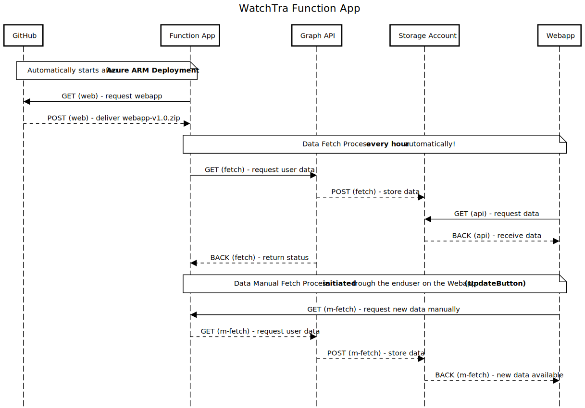

# Function App

The **Azure Function App** is the backend engine of WatchTra.  
It runs lightweight serverless functions that support both data fetching and automation.

---

## [web] - Builds and Updates the Webapp

- The Function App can trigger an automated **webapp rebuild**.  
- Pulls the latest frontend code from the **GitHub repository**.  
- Deploys updated static files into the **Azure Web App**.  
- Ensures the frontend stays synchronized with backend logic and configuration.  

---

## [fetch] - Fetch Data Every Hour

- A **timer-triggered function** queries Microsoft Graph API every hour.  
- Data includes:  
  - User attributes (Country, Department, etc.)  
  - Group memberships  
- The fetched data is stored in the **Azure Storage Account**.  
- Ensures the dashboard always shows near real-time compliance results.  

---

## [api] - Creates an API for the Frontend to Fetch Data

- Exposes REST API endpoints used by the **Azure Web App**.  
- Provides compliance status, user details, and other necessary data to the frontend.  
- Acts as a secure bridge between **Microsoft Graph API** and the WatchTra UI.  

---

## [m-fetch] - Fetch Data initiated from Enduser

- A **button triggered function** queries the newest Microsoft Graph API
- Data includes:  
  - User attributes (Country, Department, etc.)  
  - Group memberships  
- The fetched data is stored in the **Azure Storage Account**.  
- Ensures the dashboard always shows near real-time compliance results.  

---

📌 The Function App is the **automation brain** of WatchTra.
