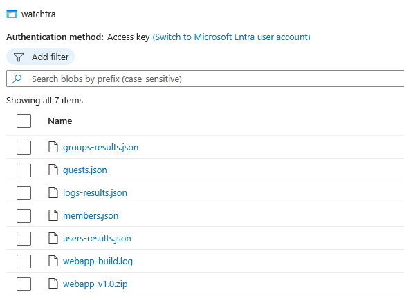

# Storage Account

The **Azure Storage Account** plays a central role in WatchTra by holding all data required for the web application.

---

## Responsibilities

- **Data Persistence**  
  - Stores compliance dictionaries (allowed values). `members.json / guests.json` 
  - Holds processed user and group data fetched from Microsoft Graph. `groups-results.json / logs-results.json / users-results.json` 

- **Frontend Assets**  
  - Serves static resources needed by the webapp. `groups-results.json / logs-results.json / users-results.json` 
  - Ensures quick and reliable delivery of UI components.  

- **Bridge Between Backend & Frontend**  
  - The Function App writes updated data into Storage.  
  - The Web App reads from Storage to display real-time compliance results.  
  - The Web App is created from newest GitHub file `webapp-v1.0.zip` 
  - The Web App is build in the destination Tenant, which is logged. `webapp-build.log` 

---

📌 The Storage Account ensures **WatchTra** remains **stateless**, reliable, and scalable by separating data storage from processing and presentation.
