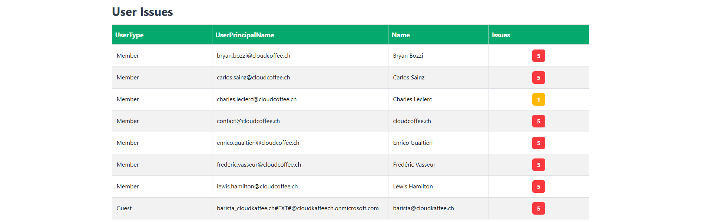

# Dashboard

## Overview

The **WatchTra Dashboard** provides a comprehensive overview of user attribute compliance within Microsoft Entra ID. It serves as a central interface for monitoring and analyzing non-compliant user attributes.

## Purpose

The dashboard is designed for IT administrators, identity specialists and SOC analysts who require insights into the consistency of attributes across Microsoft Entra ID user objects. It highlights deviations from the organizational standards defined in compliance policies and enables targeted data cleanup.

## Data Source

All displayed data originates from Microsoft Entra ID and is automatically synchronized via an Azure Function. The synchronization runs hourly, retrieves user attributes through the Microsoft Graph API and validates them against the organization’s JSON-based compliance policies.  

Only non-compliant users are displayed on the dashboard to ensure a focused view.

## Layout and Components

The dashboard is divided into two main sections: **Statistics** and **User Issues**.

### Statistics

The **Statistics** section provides an overview of the users and groups retrieved from Microsoft Entra ID. It serves as a starting point for understanding the scope of the compliance evaluation.

#### Tile Total Users

Displays the **total number** of user objects found in Microsoft Entra ID at the time of the last synchronization. This includes both member and guest accounts and represents the complete dataset that was validated against the compliance policies.

#### Tile Members

Shows the number of Entra ID users classified as **Members**. These are internal organizational accounts subject to full compliance validation for all defined attributes.

#### Tile Guests

Displays the number of **Guest** accounts present in the tenant. These users are external and may have different attribute sets. WatchTra includes them to ensure that guest-related user objects also adhere to organizational standards.

#### Tile Dynamic Groups

Shows the total number of **Dynamic Groups** configured in Entra ID. These groups are populated automatically based on attribute rules. Incorrect or inconsistent user attributes may therefore affect dynamic group memberships.

#### Last Sync

Displays the timestamp of the last data retrieval executed by the Azure Function.  

:::note
All data is automatically updated every hour by an Azure Function. A manual update can be triggered via the **Update Data** button to start an immediate attribute verification.
:::

### User Issues

The **User Issues** section lists all users with attribute violations, grouped by **UserType** (*Member*, *Guest*). Each row represents a single Entra user and shows how many compliance policy violations are currently associated with that account.

#### Table Columns

| Column | Description |
|--------|--------------|
| **UserType** | Classification of the account in Entra ID (**Member** or **Guest**). Helps distinguish internal users from external collaborators, e.g., to prioritize corrective actions. |
| **UserPrincipalName** | The sign-in name of the affected account (UPN). |
| **Name** | Display name for easier identification. |
| **Issues** | Number of non-compliant attributes detected for this user. The value is derived from validating the user’s properties against the JSON file. |

:::note
A **higher Issues count** indicates broader data quality problems for the user (multiple attributes such as `department`, `jobTitle`, or `officeLocation` failing simultaneously).
:::

### Update Data Button

The **Update Data** button manually triggers the attribute compliance synchronization process. It calls the connected **Azure Function**, which immediately executes the attribute validation cycle instead of waiting for the next scheduled hourly update.

