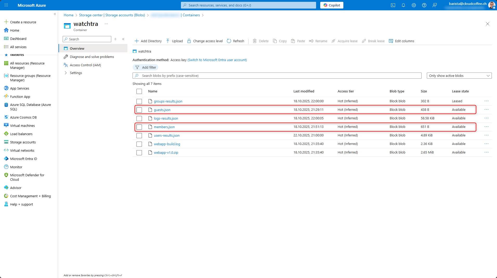

# Prerequisites

After installing WatchTra, two JSON files must be customized in the **Azure Storage Account**. These files define the **allowed attribute values** for members (`members.json`) and guest accounts (`guests.json`). They serve as the foundation for compliance validation within the dashboard.

The JSON files are located in: **Azure Storage Account > Containers > watchtra**



## Syntax of the JSON Files

The files `members.json` and `guests.json` contain the attributes to be monitored along with their allowed values.  

### Example Structure

The variable **excludeUsers** contains all **UserPrincipalNames (UPNs)** that should be excluded from monitoring by WatchTra. All other entries define the attributes to be validated and their allowed values.

```json
{
  "excludeUsers": {
    "allowed": ["emergency01@cloudkaffeech.onmicrosoft.com"]
  },
  "companyName": {
    "allowed": ["Scuderia Ferrari"]
  },
  "department": {
    "allowed": [
      "Management",
      "Technical Department",
      "Racing Team",
      "Hospitality & Team Services",
      "Communications & Media"
    ]
  },
  "officeLocation": {
    "allowed": ["Maranello", "Fiorano"]
  },
  "city": {
    "allowed": ["Maranello", "Fiorano"]
  },
  "country": {
    "allowed": ["Italy"]
  }
}
```