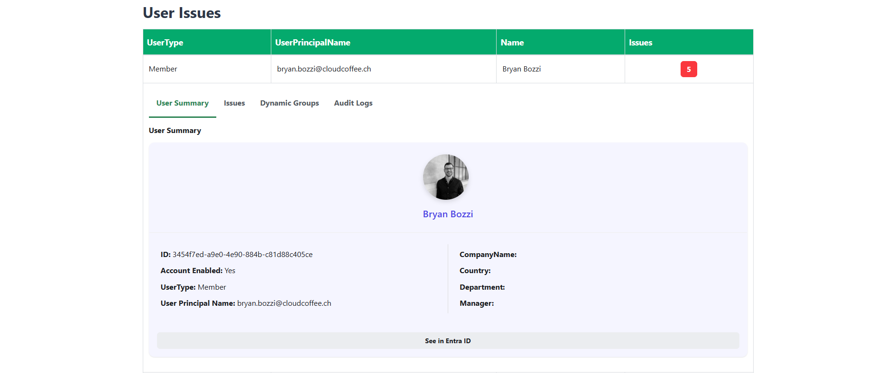
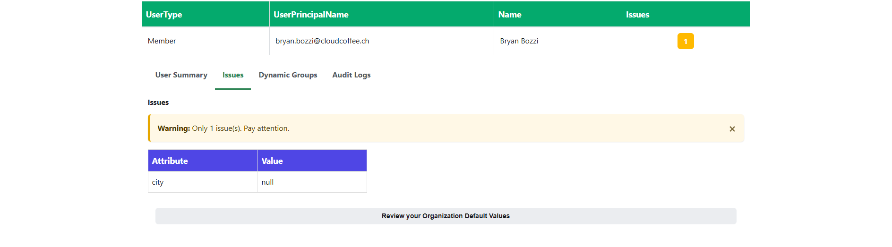
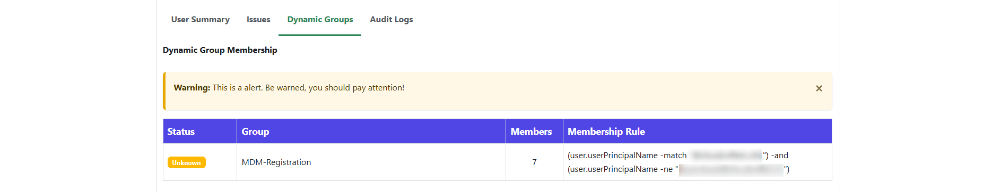
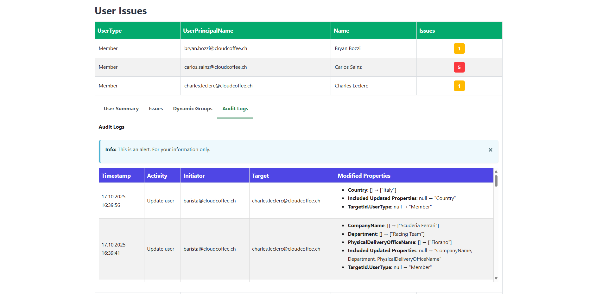

# User Issues Details

Opening a user entry displays detailed information about the object where compliance violations have been detected.

This view helps assess the user account’s current state and identify missing or inconsistent attributes within the context of Microsoft Entra ID.

## User Summary

The upper section contains a user card with the following information:

- **Profile Picture and Display Name** – shows a static user image and the full name retrieved from Microsoft Entra ID. 
- **ID** – the unique GUID of the user object in Entra ID.  
- **Account Enabled** – specifies whether the account is active in Microsoft Entra ID.
- **UserType** – indicates whether the account is a *Member* (internal user) or a *Guest* (external user). 
- **User Principal Name (UPN)** – the unique sign-in identifier of the user.  

The right-hand section lists additional attributes commonly relevant for organizational compliance policies, including: **CompanyName**, **Country**, **Department** and **Manager**.

At the bottom of the section, a **See in Entra ID** button provides a direct link to the user’s object page in the Microsoft Entra ID portal. This enables quick correction of invalid attributes or deeper investigation of the user identity.

:::note
The *User Summary* section serves for informational purposes only.  
Actual compliance violations and affected attributes are listed in detail under the [**Issues**](./userissues.md#issues) tab.
:::

## Issues

The **Issues** section lists all user attributes that violate the organization’s defined compliance policies.  
It provides a quick way to identify incorrect or incomplete data within the user object.

At the top, an alert banner summarizes the number of detected violations.  
For example, if only a single attribute is affected, the message appears as:

> **Warning:** Only 1 issue(s). Pay attention.

The attribute table provides a clear overview of the affected attributes and their current non-compliant values.

| Column | Description |
|---------|--------------|
| **Attribute** | Displays the name of the attribute that violates the compliance rules. |
| **Value** | Displays the current value retrieved from Microsoft Entra ID. If no value is present, `null` is displayed. |

In the shown example, the attribute `city` is empty, representing a violation of the organization’s defined requirements.

At the bottom, the following note is displayed:

> **Review your Organization Default Values**

This link shows the allowed values for each attribute as defined in [JSON files](./prerequisites.md).  
It is provided **for reference only**, allowing comparison between the current user values and the allowed set.

**Remediation steps:**
- **Correct the attribute in Microsoft Entra ID** (e.g., set `city` to an allowed value) and  
- then **run “Update Data”** or wait for the next **hourly sync** for the violation to disappear.

> Changes to allowed values are managed separately in [JSON files](./prerequisites.md) in the WatchTra configuration and **not** within this “Review” section.

:::note
The *Issues* tab displays only active violations.  
Once the affected attributes are corrected in Entra ID and the next synchronization via Azure Function occurs, the entry will automatically disappear from this view.
:::

## Dynamic Groups

The **Dynamic Groups** section shows which **dynamic groups** the user is a member of. This can be useful to identity gaps in your Dynamic Groups Configuration. 
Beware that abusing Dynamic Groups is a common thing for attackers to move up the leader in the target envioment.

At the top, a warning banner may appear indicating potential inconsistencies, for example:

> **Warning:** This is an alert. Be warned, you should pay attention!

Use this Tab to get insights in which Dynamic Groups this users is based on the actual User Properties. There are three Status Options:

| Status | Description |
|---------|--------------|
| **In Group** | WatchTra could identity based on the Membership Rule that this users is in the Dynamic Group |
| **Not in Group** | User is not part of this Dynamic Group, Membership Rule result is false |
| **Unkown** | The Membership Rule could not been evaluated correcly, need to be checked manually |

## Audit Logs

The **Audit Logs** section records changes to user objects detected by WatchTra via Microsoft Entra ID.  
It provides transparent tracking of when, by whom and which attributes of a user were last modified.

The table below lists each recorded change in chronological order.

| Column | Description |
|---------|--------------|
| **Timestamp** | The date and time when the change was logged, e.g., `2025-10-17 - 16:39:56`. |
| **Activity** | The type of action performed, e.g., Update user. |
| **Initiator** | Indicates which user initiated the change. |
| **Target** | The affected user object related to the change. |
| **Modified Properties** | Lists all modified attributes with their old and new values, displayed as `old → new`. |

> **Note:**  
> **Showing Log entries from the past 30 Days**
